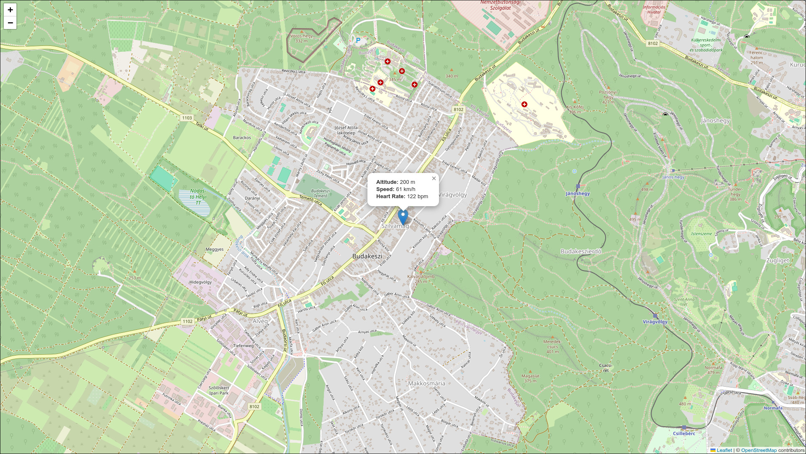

# Vibe Tracker

A simple location tracker web application built with Go, PocketBase, and Leaflet.js.



## Features

*   **Location Tracking:** Track location data (latitude, longitude, altitude, speed, heart rate) via a simple API.
*   **API Endpoints:** Accepts both `POST` (GeoJSON-like) and `GET` (URL parameters) requests.
*   **Real-time Map:** Displays the latest recorded location on a map using Leaflet.js.
*   **PocketBase Backend:** Uses PocketBase as a self-contained backend for data storage.

## Getting Started

1.  **Prerequisites:**
    *   Go (1.19+)

2.  **Installation:**
    ```bash
    go mod tidy
    ```

3.  **Running the application:**
    ```bash
    go run main.go serve
    ```

    The application will be available at `http://127.0.0.1:8090`.

## API Usage

### POST Request

```bash
curl -X POST -H "Content-Type: application/json" -H "Authorization: Bearer YOUR_USER_TOKEN" -d '{
  "type": "Feature",
  "geometry": {
    "type": "Point",
    "coordinates": [18.93, 47.51, 200]
  },
  "properties": {
    "timestamp": 1672531200,
    "speed": 60,
    "heart_rate": 120,
    "session": "your_session_id"
  }
}' http://127.0.0.1:8090/api/track
```

### GET Request

```bash
curl "http://127.0.0.1:8090/api/track?token=YOUR_USER_TOKEN&latitude=47.51&longitude=18.93&altitude=200&speed=60&heart_rate=120&session=your_session_id"
```

### GET Session LineString Request

```bash
curl "http://127.0.0.1:8090/api/session/your_username/your_session_id"
```

## Docker

Build the Docker image:

```bash
docker build -t vibe-tracker .
```

Run the Docker container:

```bash
docker run -p 8090:8090 -v $(pwd)/pb_data:/app/pb_data vibe-tracker
```
