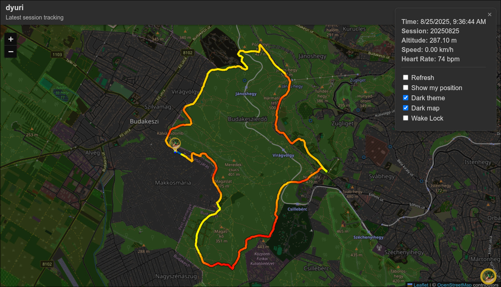

# Vibe Tracker

A simple location tracker web application built with Go, PocketBase, and Leaflet.js.



## Features

*   **Location Tracking:** Track location data (latitude, longitude, altitude, speed, heart rate) via a simple API.
*   **API Endpoints:** Accepts both `POST` (GeoJSON-like) and `GET` (URL parameters) requests.
*   **Real-time Map:** Displays the latest recorded location on a map using Leaflet.js.
*   **PocketBase Backend:** Uses PocketBase as a self-contained backend for data storage.

## Getting Started

1.  **Prerequisites:**
    *   Go (1.19+)

2.  **Installation:**
    ```bash
    go mod tidy
    ```

3.  **Running the application:**
    ```bash
    go run main.go serve
    ```

    The application will be available at `http://127.0.0.1:8090`.

## API Usage

### POST Request

```bash
curl -X POST -H "Content-Type: application/json" -d '{
  "latitude": 47.51,
  "longitude": 18.93,
  "altitude": 200,
  "speed": 60,
  "heart_rate": 120
}' http://127.0.0.1:8090/api/track
```

### GET Request

```bash
curl "http://127.0.0.1:8090/api/track?latitude=47.51&longitude=18.93&altitude=200&speed=60&heart_rate=120"
```
